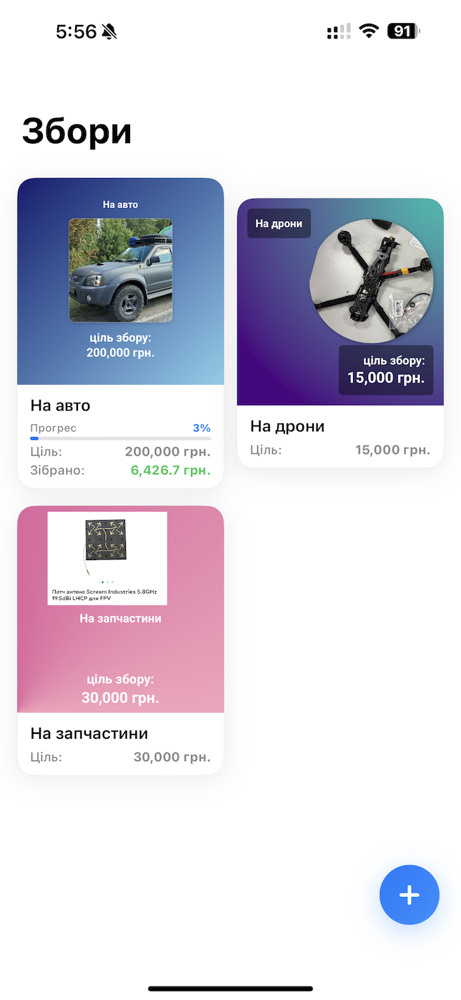
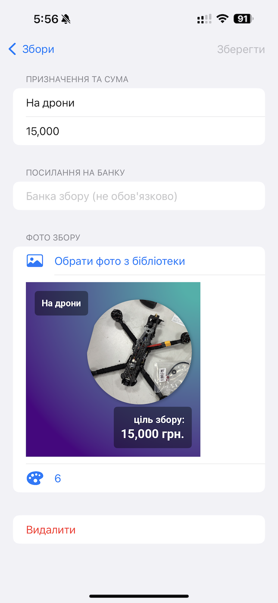
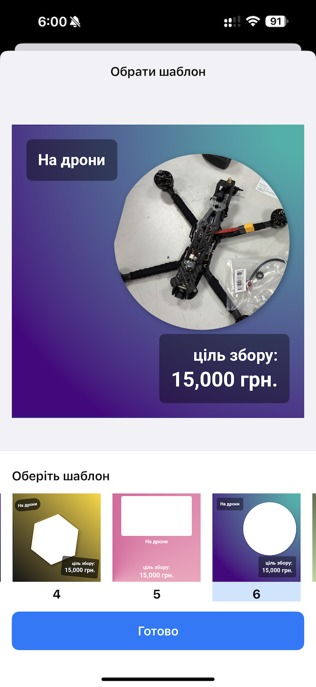

# MakeCampaign

A SwiftUI application for creating and managing donation campaign promotional materials, built with The Composable Architecture (TCA).

## Intro

MakeCampaign is an iOS app designed to help users create, manage, and generate promotional pictures for donation campaigns (збори). The app provides:

- **Campaign Management**: Create and organize multiple donation campaigns
- **Template Selection**: Choose from various promotional templates
- **Campaign Details**: Manage detailed information for each campaign
- **Data Persistence**: Automatically saves campaign data locally

The app is built using modern iOS development practices with SwiftUI for the user interface and The Composable Architecture (TCA) for state management and business logic.

## Download

[](https://apps.apple.com/ua/app/%D1%80%D0%BE%D0%B1%D0%B8%D0%B7%D0%B1%D1%96%D1%80-%D1%88%D0%B0%D0%B1%D0%BB%D0%BE%D0%BD%D0%B8-%D0%B4%D0%BB%D1%8F-%D0%B7%D0%B1%D0%BE%D1%80%D1%96%D0%B2/id6746411335)

## Screenshots

<div align="center">
  
  
  
</div>

## Installation

### Requirements
- Xcode 15.0 or later
- iOS 16.0 or later
- Swift 5.9 or later

### Setup
1. Clone the repository:
   ```bash
   git clone <repository-url>
   cd MakeCampaign
   ```

2. Open the project in Xcode:
   ```bash
   open MakeCampaign.xcodeproj
   ```

3. Build and run the project:
   - Select your target device/simulator
   - Press `Cmd + R` or click the Run button

### Dependencies
The project uses The Composable Architecture (TCA) for state management. Ensure all Swift Package Manager dependencies are resolved in Xcode.

## Data Flow

The application follows The Composable Architecture pattern with @Shared state management, providing a unidirectional data flow:

### Architecture Overview

```
User Action → Store → Reducer → State Change → View Update
```

### Navigation Structure (as of latest code)

- The app uses a `NavigationStack` powered by TCA's `StackState<Path.State>` for navigation.
- **Root View:** Campaigns list (`CampaignsView`)
- **Push Destination:** Only campaign details (`CampaignDetailsFeature`) are pushed onto the navigation stack.
- **Modal Presentation:** Template selection (`TemplateSelectionFeature`) and alerts are presented modally from within the campaign details screen, not as navigation stack destinations.

### App Entry Point

- The app's entry point is `MakeCampaignApp`, which creates an `AppView` with a `StoreOf<AppFeature>`.
- `AppView` uses `WithPerceptionTracking` for TCA state observation and binding, ensuring SwiftUI views stay in sync with the store.
- The campaigns list is the root, and navigation to details is handled via the stack.
- Dependency injection is used for previews (with `.inMemory` file storage) and for the main app (with default file storage).

### Detailed Data Flow Scheme

```
┌─────────────────────────────────────────────────────────────────────┐
│                           AppFeature (Root)                        │
│                                                                     │
│  State:                                                             │
│  ┌─────────────────────────────────────────────────────────────┐   │
│  │ • path: StackState<Path.State>()                            │   │
│  │ • campaignsList: CampaignsFeature.State()                   │   │
│  └─────────────────────────────────────────────────────────────┘   │
│                                                                     │
│  Navigation Management:                                             │
│  ┌─────────────────────────────────────────────────────────────┐   │
│  │ Path.State cases:                                           │   │
│  │ • .details(CampaignDetailsFeature)                          │   │
│  └─────────────────────────────────────────────────────────────┘   │
│                                                                     │
│  Delegate Actions:                                                  │
│  • campaignsList(.delegate(.onCampaignSelected)) → Navigate         │
└─────────────────────────────────────────────────────────────────────┘
                                      │
                                      ▼
┌─────────────────────────────────────────────────────────────────────┐
│                          CampaignsFeature                          │
│                                                                     │
│  Shared State Management:                                           │
│  ┌─────────────────────────────────────────────────────────────┐   │
│  │ @Shared(.campaigns) var campaigns                            │   │
│  │ • Persistent file storage: .fileStorage(.campaigns)         │   │
│  │ • Default: empty IdentifiedArrayOf<Campaign>                │   │
│  └─────────────────────────────────────────────────────────────┘   │
│                                                                     │
│  Presentation State:                                                │
│  ┌─────────────────────────────────────────────────────────────┐   │
│  │ @Presents var addCampaign: CampaignDetailsFeature.State?    │   │
│  └─────────────────────────────────────────────────────────────┘   │
│                                                                     │
│  Jar API Integration:                                               │
│  ┌─────────────────────────────────────────────────────────────┐   │
│  │ onViewInitialLoad:                                           │   │
│  │ • Parallel TaskGroup for campaigns with jar links           │   │
│  │ • jarApiClient.loadProgress(jarLink) → JarDetails           │   │
│  │ • Updates shared campaigns with jar details                 │   │
│  └─────────────────────────────────────────────────────────────┘   │
│                                                                     │
│  Actions:                                                           │
│  • createCampaignButtonTapped → Present modal                      │
│  • campaignSelected(id) → Send delegate action                     │
│  • onCampaignJarDetailsLoaded → Update shared state                │
└─────────────────────────────────────────────────────────────────────┘
                                      │
                                      ▼
┌─────────────────────────────────────────────────────────────────────┐
│                      CampaignDetailsFeature                        │
│                                                                     │
│  Shared Campaign State:                                             │
│  ┌─────────────────────────────────────────────────────────────┐   │
│  │ @Shared var campaign: Campaign                               │   │
│  │ • Direct reference to shared campaign instance              │   │
│  │ • Changes automatically persist through @Shared system      │   │
│  └─────────────────────────────────────────────────────────────┘   │
│                                                                     │
│  State Management:                                                  │
│  ┌─────────────────────────────────────────────────────────────┐   │
│  │ • focus: Field? (for form focus management)                 │   │
│  │ • validationErrors: ValidationErrors                        │   │
│  │ • selectedImage: SelectedImage?                             │   │
│  │ • isEditing: Bool                                            │   │
│  │ • initialCampaign: Campaign (for change detection)          │   │
│  └─────────────────────────────────────────────────────────────┘   │
│                                                                     │
│  Destination Management:                                            │
│  ┌─────────────────────────────────────────────────────────────┐   │
│  │ @Presents var destination: Destination.State?               │   │
│  │ • .alert(AlertState) - various alerts                       │   │
│  │ • .templateSelection(TemplateSelectionFeature)              │   │
│  └─────────────────────────────────────────────────────────────┘   │
│                                                                     │
│  Validation System:                                                 │
│  ┌─────────────────────────────────────────────────────────────┐   │
│  │ Field validation via ValidationClient:                      │   │
│  │ • name (campaign.purpose)                                   │   │
│  │ • target (campaign.formattedTarget)                         │   │
│  │ • link (campaign.jarURLString)                              │   │
│  │ • image (campaign.image?.raw)                               │   │
│  │ • template (campaign.template)                              │   │
│  └─────────────────────────────────────────────────────────────┘   │
│                                                                     │
│  Photo Management Flow:                                             │
│  ┌─────────────────────────────────────────────────────────────┐   │
│  │ PhotosPickerItem → Data conversion → Campaign.image update  │   │
│  │ PHAuthorization check → CampaignRenderer → PhotoLibrarySave │   │
│  └─────────────────────────────────────────────────────────────┘   │
│                                                                     │
│  Campaign Operations:                                               │
│  • onSaveButtonTapped → Render & save to photo library             │
│  • onCampaignDeleteButtonTapped → Remove from shared campaigns     │
│  • onTemplateButtonTapped → Present template selection             │
└─────────────────────────────────────────────────────────────────────┘
                                      │
                                      ▼
┌─────────────────────────────────────────────────────────────────────┐
│                     TemplateSelectionFeature                       │
│                                                                     │
│  Shared Campaign Reference:                                         │
│  ┌─────────────────────────────────────────────────────────────┐   │
│  │ @Shared var campaign: Campaign                               │   │
│  │ • Same shared reference as CampaignDetailsFeature           │   │
│  │ • Direct updates to campaign.template, imageScale, offset   │   │
│  └─────────────────────────────────────────────────────────────┘   │
│                                                                     │
│  Template Management:                                               │
│  ┌─────────────────────────────────────────────────────────────┐   │
│  │ • selectedTemplateID: Template.ID?                          │   │
│  │ • templates: IdentifiedArrayOf<Template> = Template.list    │   │
│  │ • selectedTemplate: Template? (computed)                    │   │
│  └─────────────────────────────────────────────────────────────┘   │
│                                                                     │
│  Template Application Flow:                                         │
│  ┌─────────────────────────────────────────────────────────────┐   │
│  │ templateSelected(template):                                  │   │
│  │ • Reset imageScale = 1, imageOffset = .zero                 │   │
│  │ • Set campaign.template = template                          │   │
│  │                                                              │   │
│  │ onImageRepositionFinished(scale, offset):                   │   │
│  │ • Update campaign.imageScale & campaign.imageOffset         │   │
│  │                                                              │   │
│  │ doneButtonTapped:                                            │   │
│  │ • Send delegate(.templateApplied) → dismiss                 │   │
│  └─────────────────────────────────────────────────────────────┘   │
│                                                                     │
│  Delegate Actions:                                                  │
│  • templateApplied(Template, forCampaign: Campaign.ID)              │
└─────────────────────────────────────────────────────────────────────┘

Data Flow Patterns:

1. SHARED STATE FLOW:
   • @Shared(.campaigns) provides persistent storage via FileStorageKey
   • All campaign modifications automatically persist
   • CampaignDetailsFeature & TemplateSelectionFeature share same campaign reference

2. NAVIGATION FLOW:
   CampaignsView.campaignSelected → CampaignsFeature.delegate(.onCampaignSelected)
   → AppFeature navigation → path.append(.details(campaign: shared))
   CampaignDetails.templateButton → destination = .templateSelection

3. TEMPLATE SELECTION FLOW:
   Template selection → campaign.template update (via @Shared)
   → Image repositioning → campaign.imageScale/Offset update
   → Done → delegate(.templateApplied) → dismiss → back to CampaignDetails

4. VALIDATION FLOW:
   User input → @Shared campaign updates → validateForm() trigger
   → ValidationClient field validation → ValidationErrors update → UI refresh

5. SAVE FLOW:
   CampaignDetails.save → Permission check → CampaignRenderer.render
   → PhotoLibrarySaver.saveImage → campaigns.append(campaign) via @Shared

6. JAR API FLOW:
   CampaignsFeature.onViewInitialLoad → TaskGroup parallel calls
   → jarApiClient.loadProgress → onCampaignJarDetailsLoaded
   → campaigns[id].jar.details update via @Shared
```

### Key Components

**AppFeature**: Root feature managing navigation and coordinating child features
- Manages navigation stack using `StackState<Path.State>`
- Delegates campaign selection to navigate to details
- Contains `CampaignsFeature` as scoped child feature

**AppView**: SwiftUI entry point for the app's UI
- Uses `WithPerceptionTracking` for TCA state observation and binding
- Hosts the navigation stack and root campaigns list
- Handles navigation to campaign details

**MakeCampaignApp**: Application entry point
- Instantiates the root store and injects it into `AppView`
- Supports dependency injection for previews and main app

**CampaignsFeature**: Campaign list management with persistent storage
- Uses `@Shared(.campaigns)` for automatic file-based persistence
- Loads jar progress details via parallel API calls on view load
- Presents new campaign creation modal via `@Presents`
- Sends delegate actions for campaign selection navigation

**CampaignDetailsFeature**: Complex form with validation and media management
- Operates on `@Shared var campaign` for direct state updates
- Comprehensive validation system with field-specific error tracking
- Photo picker integration with permission handling and library saving
- Template selection via destination presentation
- Campaign deletion from shared campaigns array

**TemplateSelectionFeature**: Template picker with image positioning
- Shares same `@Shared var campaign` reference for direct updates
- Template selection with automatic image scale/offset reset
- Interactive image positioning controls
- Delegate action communication for completion state

### State Management Architecture

**@Shared System**: 
- Campaigns stored in `FileStorageKey<IdentifiedArrayOf<Campaign>>`
- Automatic persistence to `campaigns.json` in Documents directory
- Direct state sharing between features eliminates manual synchronization

**Validation Flow**:
- Field-level validation via `ValidationClient` dependency
- Real-time error tracking in `ValidationErrors` struct
- Form validity computed from all field validation states

**Navigation Pattern**:
- Stack-based navigation via TCA's `StackState` for campaign details
- Modal presentation for template selection and alerts from within details
- Delegate actions for cross-feature communication
- Presentation states for modals and sheets

This architecture provides type-safe state management, automatic persistence, and clear separation of concerns while maintaining predictable data flow throughout the application.
